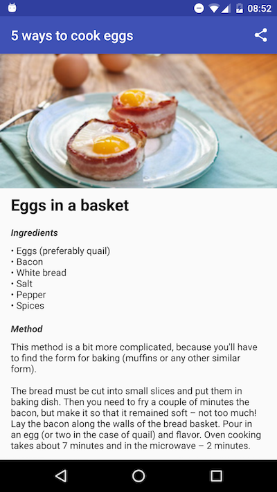

This my first Android project that was created during *Android Study Jams* meet-ups sponsored by Google. These meet-ups was held at TechMagic company in Lviv, Ukraine. For learning materials every student used [Android for beginners](https://www.udacity.com/course/android-basics-user-interface--ud834) Udacity online course.

# Summary

Simple android app with 5 recipes for breakfast.

## Recipes
Each card shows recipe image, its name, ingredients in one line and share button.

    

## Recipe details
This screen displays details of proper recipe.
Share action button located on the top of the screen.

    

Bon appétit!
